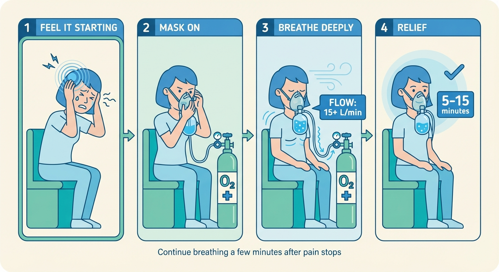

# High-Flow Oxygen for Cluster Headaches

*A patient's guide to getting set up with oxygen therapy — from prescription to relief.*

---

Oxygen is one of the most effective treatments for cluster headache attacks. It is recommended as a first-line abortive treatment by every major headache guideline — including the American Headache Society, the European Academy of Neurology, and NICE in the UK. It has an excellent safety profile: sessions under an hour pose very little risk of side effects. And when done correctly — with the right equipment, the right flow rate, and the right technique — it can work close to 100% of the time.

If you've just learned that oxygen can stop your attacks, you're in the right place. This guide will walk you through every step of making it work.

## What aborting with oxygen looks like

Here's the short version: you feel an attack coming on, you sit down, you put on your oxygen mask, and you breathe. Within minutes, the pain starts to fade. Most patients who respond find relief within 5–15 minutes. Some find relief in as little as 3–6 minutes. You continue breathing for a few minutes after the pain stops to prevent it from coming back. Then you turn off the tank, take off the mask, and go on with your day.

That's it. No injections, no pills, no side effects. Just oxygen.

*The basic sequence: feel the attack starting, put on the mask, breathe deeply at high flow, and the pain fades within minutes.*

## What this guide covers

Getting set up with oxygen is not always straightforward — but it is absolutely worth the effort. This guide covers the entire process:

1. **[How oxygen works](02-how-oxygen-works.md)** — Why high-flow oxygen stops cluster headache attacks, how long it takes, and what to expect.
2. **[Getting a prescription](03-getting-a-prescription.md)** — What to say to your doctor, what a correct prescription looks like, and how to handle pushback.
3. **[What you need](04-equipment.md)** — The equipment you'll need: oxygen tanks, regulators, and masks — and which ones actually work.
4. **[Getting your oxygen](05-working-with-suppliers.md)** — How to work with suppliers, set up at home, and handle common problems.
5. **[Using oxygen effectively](06-using-oxygen.md)** — The step-by-step aborting procedure, breathing techniques, and how to optimise your setup.
6. **[Frequently asked questions](07-faq.md)** — Tank math, travel, safety, and everything else.

## Expect friction — and persist

Here's something nobody tells you upfront: getting oxygen set up for cluster headaches can be frustrating. Your doctor may not know that oxygen is a first-line treatment. Your insurance may push back. Your supplier may send the wrong equipment. You may have to make phone calls, switch doctors, or learn things you never expected to learn about medical-grade oxygen.

This is normal. Almost every cluster headache patient who uses oxygen today went through some version of this. The guide will walk you through the common obstacles and how to get past them.

The payoff is a treatment that is safe, effective, and available every time you need it — multiple times a day if necessary — without the side effects or limitations of medications.

## A note on faster alternatives

Oxygen is excellent, but it's not the fastest option available. Some cluster headache patients report that inhaled (vaporised) DMT can abort attacks in under a minute — far faster than the 5–15 minutes typical with oxygen. Many patients use both: oxygen as their primary, everyday abortive, and DMT when speed is critical.

If you're interested, we have a separate [DMT guide](index.html) that covers safety, preparation, and usage. The two treatments complement each other well.

## Disclaimer

This guide is for informational and harm-reduction purposes only. It is not medical advice. Always consult a qualified healthcare professional before starting any new treatment. The information here is based on published research and patient experience, but your situation may be different — work with your doctor to find what's right for you.

---

*Next: [How oxygen works →](02-how-oxygen-works.md)*
