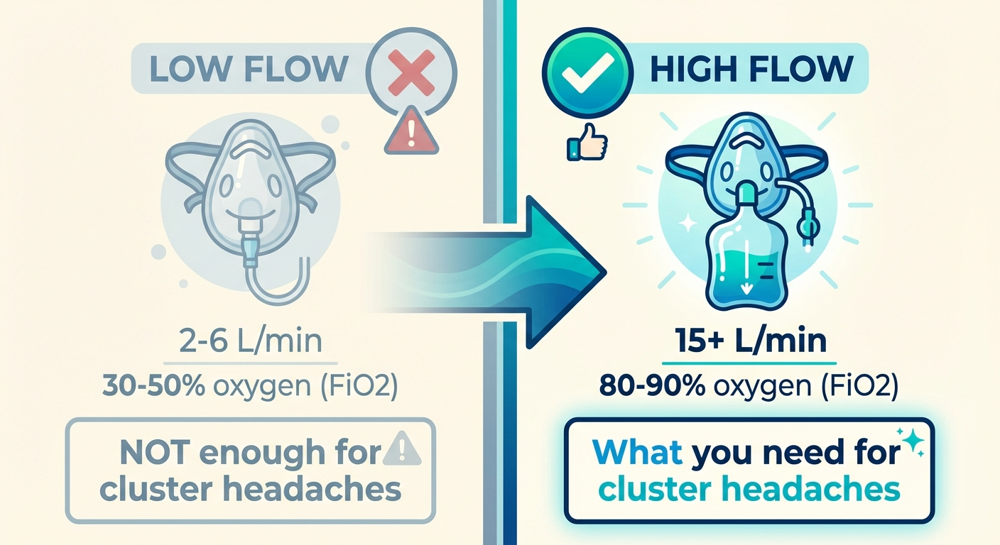

# How Oxygen Works

You don't need to understand the neuroscience to use oxygen effectively. But knowing the basics will help you in two ways: it makes you a more confident advocate when talking to doctors, and it helps you understand why the equipment details matter so much.

---

## Why oxygen stops the pain

During a cluster headache attack, something goes wrong in the autonomic nervous system — the part of your body that controls things like blood flow, tear production, and nasal congestion. The parasympathetic nervous system fires excessively on one side of your face, which is why you get a runny nose, tearing eye, or drooping eyelid alongside the pain. Researchers believe the hypothalamus — a deep brain structure that acts as a kind of "clock" for cluster cycles — triggers this cascade.

High-flow oxygen appears to interrupt this process through several pathways:

- **It calms the overactive parasympathetic response.** Animal studies show that oxygen acts on the parasympathetic pathways rather than directly on the pain nerves themselves.
- **It reduces CGRP — a key pain molecule.** CGRP (calcitonin gene-related peptide) is central to headache pain signalling. Researchers have found that oxygen treatment significantly reduces CGRP levels in the blood. This is the same molecule targeted by newer migraine medications like erenumab and fremanezumab.
- **It constricts blood vessels.** The original theory from the 1960s was that oxygen narrows dilated blood vessels around the brain. While this does happen, it's now considered a secondary effect rather than the main mechanism.

The exact mechanism is still being studied, but the clinical evidence is strong: oxygen works, it works fast, and it works without significant side effects.

## Why "high-flow" matters

Not all oxygen therapy is the same. The key concept is **FiO2** — the fraction of inspired oxygen, or simply: how much of each breath is actually oxygen versus room air.

Room air is about 21% oxygen. When you breathe through a regular oxygen mask at low flow rates (2–6 L/min), you're getting a mix of oxygen and room air — perhaps 30–50% oxygen overall. That's useful for patients with lung disease, but it's not enough for cluster headaches.

For cluster headaches, you need as close to 100% oxygen as possible:

- **A non-rebreather mask at 15 L/min** delivers approximately 80–90% oxygen. The reservoir bag stores pure oxygen for you to inhale, and one-way valves prevent you from rebreathing your own exhaled air. Some room air still leaks in through the side holes (which is why many patients tape them shut).
- **A demand valve** delivers 100% oxygen — no room air mixed in at all. It only releases oxygen when you inhale, so nothing is wasted.

This is why getting the right equipment matters so much. A standard hospital oxygen mask at 4 L/min will feel like it does nothing for a cluster headache. That doesn't mean oxygen doesn't work — it means the setup was wrong.

*The difference between low-flow and high-flow setups. At low flow rates, you're diluting oxygen with room air and only reaching 30–50% FiO2. At high flow with the right mask, you approach 100%.*

## How long it takes

Setting realistic expectations helps you stay the course:

- **3–6 minutes:** Some patients — especially those using demand valves and aggressive breathing techniques — feel significant relief this quickly.
- **5–15 minutes:** The typical range. The landmark clinical trial (Cohen et al., 2009) found 78% of patients were pain-free at 15 minutes using 12 L/min via a non-rebreather mask.
- **15–20 minutes:** Still within the normal response window. If you're at 10 minutes and still in pain, keep going.

The key variable is how early you start. Oxygen is dramatically more effective when you begin breathing at the very first sign of an attack. If you wait until the pain has peaked, it may take longer or work less completely.

## Who it works for

Oxygen can approach 100% effectiveness when the setup and technique are right. Studies that report lower response rates — typically 70–80% — may partly reflect suboptimal equipment or technique. In the Cohen et al. trial, for example, the flow rate was 12 L/min via a non-rebreather mask. Many experienced patients use higher flow rates and demand valves, and report even better results.

That said, some factors have been associated with a weaker oxygen response in patient surveys:

- Chronic cluster headache (as opposed to episodic)
- Longer individual attack duration
- Accompanying light or sound sensitivity
- Headache between attacks (interictal headache)

If you're finding that oxygen isn't working, the most productive first step is to review your setup — flow rate, mask type, mask seal, and timing. The [Using oxygen effectively](06-using-oxygen.md) page covers this in detail. The majority of patients who think oxygen "doesn't work" have a fixable equipment or technique problem.

---

*← [Introduction](01-intro.md) | [Getting a prescription →](03-getting-a-prescription.md)*
