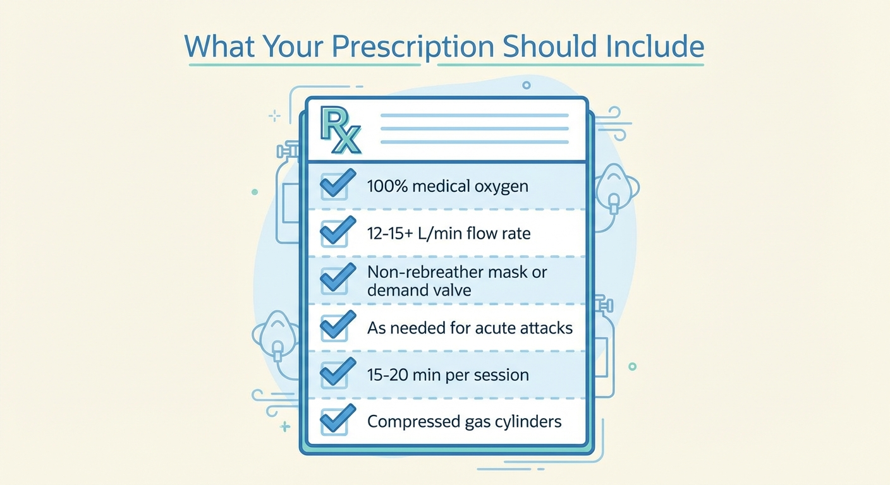

# Getting a Prescription

In most countries, medical-grade oxygen requires a prescription. This section will help you get one — even if your doctor isn't familiar with oxygen therapy for cluster headaches.

---

## You need a prescription

Oxygen is classified as a medical product in the US, UK, EU, Canada, Australia, and most other countries. To get it delivered to your home through legitimate medical channels, you need a doctor's prescription. This is true whether your oxygen comes through insurance, the NHS, or a private supplier.

The good news: oxygen therapy for cluster headaches is endorsed by every major headache guideline in the world. If your doctor says no, it's not because the evidence isn't there — it's because they may not be aware of it.

## What the prescription should say

A correct oxygen prescription for cluster headaches should include all of these elements:

- **100% oxygen** (not blended or low-concentration oxygen)
- **High-flow delivery** — at least 12–15 L/min, ideally higher. Some prescriptions specify "up to 25 L/min" to give you room to experiment. The higher the better.
- **Non-rebreather mask or demand valve mask** — not a nasal cannula, not a simple face mask. These don't deliver enough oxygen.
- **As needed for acute cluster headache attacks** — this means you can use it whenever an attack hits, not on a fixed schedule.
- **Duration: 15–20 minutes per session** (or longer — sessions under an hour are very safe)
- **Compressed gas cylinders** (not an oxygen concentrator, unless explicitly justified — most concentrators can't deliver the flow rates you need)

*The key elements of a cluster headache oxygen prescription. If any of these are missing or wrong, you may end up with equipment that doesn't work.*

### Common prescription errors to watch for

- **Flow rate too low.** A prescription for "2–4 L/min" is for COPD, not cluster headache. You need at least 12–15 L/min.
- **Nasal cannula instead of a mask.** A nasal cannula delivers 25–40% oxygen at best. You need a non-rebreather mask or demand valve for 80–100%.
- **Oxygen concentrator instead of tanks.** Most home concentrators max out at 5–10 L/min — well below what you need. Unless the prescription specifically calls for a high-flow concentrator, insist on compressed gas.
- **Missing "as needed" language.** Without it, a supplier may limit how much oxygen you receive.

If your prescription doesn't look right, don't accept it silently. Show your doctor the correct specifications and ask them to revise it. You're not being difficult — you're preventing weeks of frustration with equipment that won't work.

## Talking to your doctor

Many doctors — even neurologists — are not familiar with oxygen therapy for cluster headaches. Cluster headache affects roughly 0.1% of the population, and oxygen treatment is not widely taught in medical schools. You may need to educate your doctor. Here's how.

### Key talking points

**"Oxygen is recommended as a first-line treatment by every major guideline."**

- The **American Headache Society** (2016) gives it a **Level A recommendation** — the highest level of evidence.
- The **European Academy of Neurology** (2023) lists it as one of only two "strongly recommended" acute treatments (alongside subcutaneous sumatriptan).
- **NICE** in the UK recommends 100% oxygen at 12–15 L/min via non-rebreather mask.

**"The clinical evidence is strong."**

- The landmark randomised controlled trial (Cohen et al., 2009, published in *JAMA*) found that **78% of patients treated with oxygen were pain-free at 15 minutes**, compared to 20% with placebo air. This is one of the strongest treatment effects in headache medicine.

**"It's extremely safe."**

- No significant adverse events were reported in the Cohen trial or in subsequent reviews. The exposure time is short (15–60 minutes per session), far below the threshold for oxygen toxicity concerns.

### If your doctor says no

- **Ask for a referral to a neurologist or headache specialist.** GPs may not feel comfortable prescribing something outside their usual scope. A headache specialist will almost certainly know about oxygen for cluster headaches.
- **Print out the guideline.** The AHS evidence-based guidelines and the EAN 2023 guidelines are both freely available online. A printed summary can be more persuasive than a verbal conversation.
- **Switch doctors if necessary.** This sounds drastic, but patients report that it is sometimes the fastest path. A doctor who dismisses guideline-endorsed treatment for a condition this painful may not be the right doctor for you.

## "Insurance won't cover it"

This is one of the most common — and most frustrating — things patients hear. The reality is more nuanced than "insurance won't cover it."

### In the United States

Medicare coverage for home oxygen for cluster headaches has improved significantly in recent years. In September 2021, CMS (Centers for Medicare & Medicaid Services) retired the previous restriction that required patients to be enrolled in clinical trials to receive coverage. Coverage is now determined by your regional Medicare Administrative Contractor (MAC), which means it varies by region — but the door is open.

For private insurance: many plans do cover home oxygen for cluster headache, especially with documentation of medical necessity. Key steps:

- **Ask your doctor to document the diagnosis clearly** — ICD-10 code G44.009 (cluster headache, unspecified) or G44.019 (episodic cluster headache).
- **Call your insurer directly.** Don't rely on your doctor's office or supplier to check coverage on your behalf. Call the number on your insurance card and ask: "Is home oxygen therapy covered for cluster headache?"
- **If denied, appeal.** Attach the AHS guideline and the Cohen et al. trial. Many initial denials are overturned on appeal.

### In the United Kingdom

Oxygen for cluster headaches is available through the NHS. The process:

1. Get diagnosed by a neurologist or headache specialist.
2. Your GP fills out a **Home Oxygen Order Form (HOOF)** — cluster headache is explicitly listed as a qualifying condition on this form.
3. A brief safety assessment is conducted (fire risk, smoking status).
4. The oxygen supplier (typically BOC or Baywater) contacts you and delivers the equipment to your home.

If your GP hesitates, point them to the **HOOF form itself** (which lists cluster headache), the **BNF** (British National Formulary) entry for oxygen in cluster headache, or the **NICE CG150 guideline**.

### General principle

Wherever you are: call your insurer or healthcare system directly and ask. The answer may surprise you. If one person says no, ask to speak to someone else, or ask your doctor to submit documentation. Persistence pays off.

## If you can't get a prescription

If you've exhausted the official routes — or if you're in a country where medical oxygen is difficult to access — there are alternatives. These are last-resort options, not first choices.

### Welding oxygen

Welding-grade oxygen is chemically identical to medical-grade oxygen — it's the same O₂ molecule. The difference is regulatory: medical oxygen is produced and stored under stricter quality controls to prevent contamination. In practice, many welding oxygen suppliers use the same production process as medical suppliers, and contamination is rare.

Roughly 12% of US cluster headache patients who use oxygen report using welding-grade oxygen. It's cheaper, doesn't require a prescription, and is available from welding supply shops.

**The risks are low but real:** welding tanks may have residual oils, moisture, or other contaminants from prior use. If you go this route, use a dedicated tank that has only been filled with oxygen, and buy a proper CGA 540 regulator designed for oxygen (not acetylene or other gases).

### Oxygen concentrators

Home oxygen concentrators extract oxygen from room air. They're inexpensive to run (no refills) and available without a prescription in many countries.

**The problem:** most home concentrators max out at 5–10 L/min and produce 90–95% oxygen — both below what you ideally want for cluster headaches. A small number of patients make them work, but the results are generally inferior to high-flow tank oxygen.

If a concentrator is your only option, it's better than nothing — but treat it as a bridge to proper equipment, not a destination.

---

*← [How oxygen works](02-how-oxygen-works.md) | [What you need →](04-equipment.md)*
