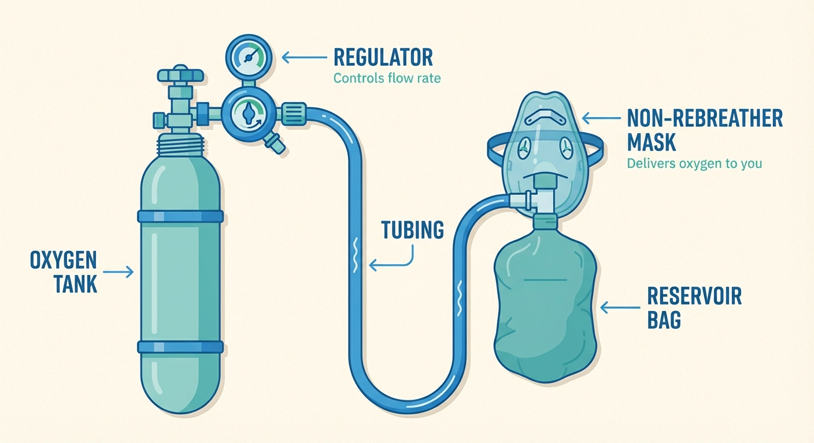

# What You Need

You need three things to use oxygen for cluster headaches: an **oxygen source**, a **regulator** (the device on top of the tank that controls oxygen flow), and a **mask**. Getting any one of these wrong can make oxygen feel like it doesn't work. This page tells you exactly what to look for.

---

## The three components

Think of it as a chain: the tank stores the oxygen, the regulator controls the flow, and the mask delivers it to your lungs. Every link matters.

*The three components: oxygen tank (or cylinder), regulator with flow control, and mask. All three must be right for oxygen therapy to work.*

## Oxygen source

### Compressed gas cylinders (tanks)

This is the standard and recommended option. Medical oxygen comes in steel or aluminum cylinders at high pressure. The key question is size: how much oxygen does each tank hold, and how long does it last at the flow rate (liters per minute, or L/min) you need?

Common tank sizes:

These size labels (E, M, H/K) are standard in the US and widely understood by suppliers in most English-speaking countries. Your supplier will know what you mean.

| Size | Height | Weight | Capacity | Duration at 15 L/min | Duration at 25 L/min | Typical use |
|------|--------|--------|----------|----------------------|----------------------|-------------|
| **E** | ~75 cm / 30 in | ~8 kg / 18 lbs | ~680 liters | ~45 minutes | ~27 minutes | Portable, backup |
| **M** | ~120 cm / 47 in | ~14 kg / 30 lbs | ~3,000 liters | ~3.3 hours | ~2 hours | Primary home use |
| **H/K** | ~140 cm / 55 in | ~60 kg / 135 lbs | ~6,900 liters | ~7.5 hours | ~4.5 hours | Heavy use, fewer refills |

**Recommendations:**

- **Have at least two tanks.** When one runs out — and it will, mid-attack if you're unlucky — you need a backup immediately. Running out of oxygen during an attack is one of the most stressful experiences patients describe.
- **Start with M-size tanks** for home use. They're a good balance of capacity and manageability. H/K tanks hold more but are heavy and harder to move.
- **Keep an E-size tank** as a portable or car backup.
- **Track your usage** so you can schedule refills before you run out, not after.

### Other oxygen sources

**Oxygen concentrators** are electrical devices that extract oxygen from room air — no refills needed. The problem: most home concentrators produce 90–95% oxygen at a maximum of 5–10 L/min, well below the 15+ L/min you need. Not recommended as a primary source, but better than nothing if tanks aren't available.

**Liquid oxygen** systems are compact and can deliver high flow rates, but they're rare for home use, more expensive, and require special handling. A legitimate option if your supplier offers them — but most patients use compressed gas cylinders.

## Regulator

The regulator attaches to the top of the tank and controls the flow rate — how many liters per minute of oxygen reach your mask. This is where one of the most common and costly mistakes happens.

Many standard medical oxygen regulators only go up to 8 L/min — designed for COPD patients who breathe at 2–4 L/min. **They are not adequate for cluster headaches.** If your supplier sends one, do not accept it.

**What to look for:**

- **Flow range:** 0–15 L/min minimum, 0–25 L/min preferred. A 25 L/min regulator gives you room to experiment with higher flow rates, which many experienced patients prefer.
- **CGA 540 connection** (in the US) — the standard connector type for oxygen cylinders. If you're outside the US, ask your supplier what connector type your tanks use.
- **Outlet fitting:** Make sure your regulator's outlet fitting matches your mask tubing. If buying separately, check compatibility.

Regulators do not require a prescription — if your supplier can't provide a high-flow one, you can buy one separately from medical supply retailers for $30–80. It's a one-time purchase that makes all the difference.

## Mask

There are two mask options worth considering, and the choice matters more than most people realize.

### Non-rebreather mask (NRM)

The standard option. A non-rebreather mask has:

- A **reservoir bag** that fills with pure oxygen from the tank
- **One-way exhalation valves** — round plastic discs (usually one on each side of the mask) that open when you breathe out and close when you breathe in. These let exhaled air escape while preventing room air from entering. **Do not tape these.**
- **Small open holes** — separate from the valves, these are small circular holes on the sides of the mask (usually two or three per side). They exist as a safety feature to let room air in if the oxygen supply fails, but during normal use they dilute your oxygen. **Tape these shut** with medical tape or electrical tape to get the highest oxygen concentration.
- A **face seal** that covers your nose and mouth

At 15 L/min, a non-rebreather mask delivers approximately 80–90% oxygen. The remaining 10–20% is room air leaking in around the edges and through the open side holes — taping the holes closed brings you closer to 90%.

**Pros:** Cheap (a few dollars each), widely available, disposable (keep spares on hand).

**Cons:** Not a perfect seal — some room air still leaks around the edges. The reservoir bag can collapse if you breathe faster than it fills. Some patients find the fit uncomfortable.

### Demand valve oxygen mask (DVO)

The preferred option if you can get one. A demand valve replaces the standard regulator — it connects directly to the tank and has a mask or mouthpiece attached. You breathe in, and it delivers a burst of pure oxygen. Specifically, it:

- Delivers **100% oxygen** — no room air mixed in at all
- Releases oxygen **only when you inhale** — none is wasted between breaths
- Supports **hyperventilation** — it can deliver as fast as you can breathe
- Creates a proper **face seal** for consistent delivery

In the only head-to-head clinical trial (Petersen et al., 2017), demand valves reduced the need for rescue medication compared to simple masks (23% vs. 50%) and were strongly preferred by patients (62% preferred the demand valve).

**Pros:** 100% oxygen delivery, more efficient use of tank oxygen, supports aggressive breathing.

**Cons:** More expensive upfront (roughly $250–400+ for the valve and mask), requires a specific connection to the regulator, may need to be purchased separately. Search for "demand valve oxygen mask" at medical supply retailers or online medical equipment stores.

**Recommendation:** If you can get a demand valve — through your supplier, your insurance, or by purchasing one yourself — it's worth it. If not, a non-rebreather mask with the side holes taped shut is a solid fallback.

In the UK, demand valves are available on the NHS for patients with chronic cluster headache (attacks for more than a year without a remission of at least three months). Patients with episodic cluster headache (attack periods separated by remission) can rent one from BOC.

## Quick reference card

| Component | What to look for | Common mistake | Approximate cost |
|-----------|-----------------|----------------|-----------------|
| **Oxygen tank** | M or H size, at least 2 tanks | Only having one tank | Varies (often covered by insurance) |
| **Regulator** | 0–25 L/min range, CGA 540 fitting | Getting a 0–8 L/min COPD regulator | $30–80 |
| **Mask (NRM)** | Non-rebreather with reservoir bag | Simple face mask or nasal cannula | $2–5 each (keep spares) |
| **Mask (DVO)** | Demand valve with face seal | — | $250–400+ one-time |

## Safety basics

- **Keep tanks upright and secured** in a stand, rack, or strapped to a wall. A fallen tank with a broken valve can become a projectile.
- **Keep away from heat and open flame.** Oxygen doesn't burn, but it makes everything around it burn faster and hotter. Stay at least 5–10 feet (2–3 meters) from stoves, heaters, candles, and sparks. Do not smoke near oxygen.
- **Store in a ventilated area.** A slow leak in an enclosed space raises fire risk.

For more on safe storage and setup, see the [supplier page](05-working-with-suppliers.md#setting-up-at-home).

---

*← [Getting a prescription](03-getting-a-prescription.md) | [Getting your oxygen →](05-working-with-suppliers.md)*
