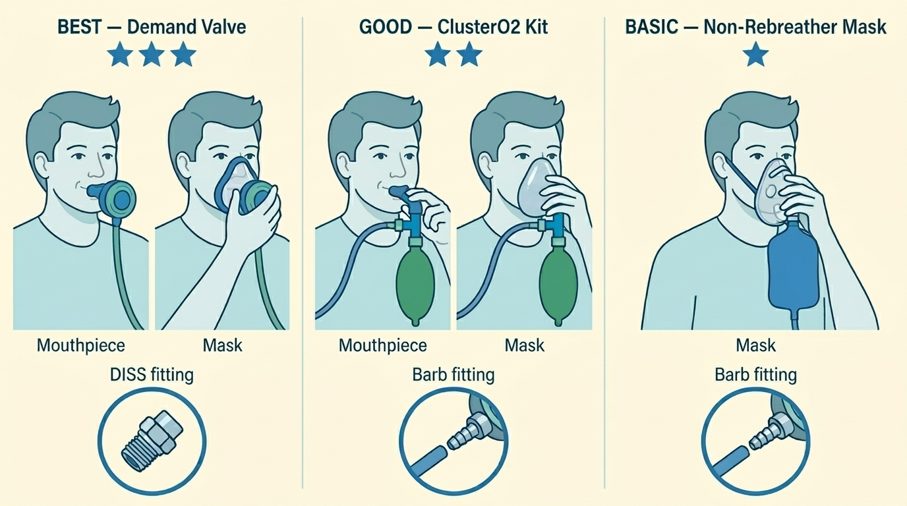
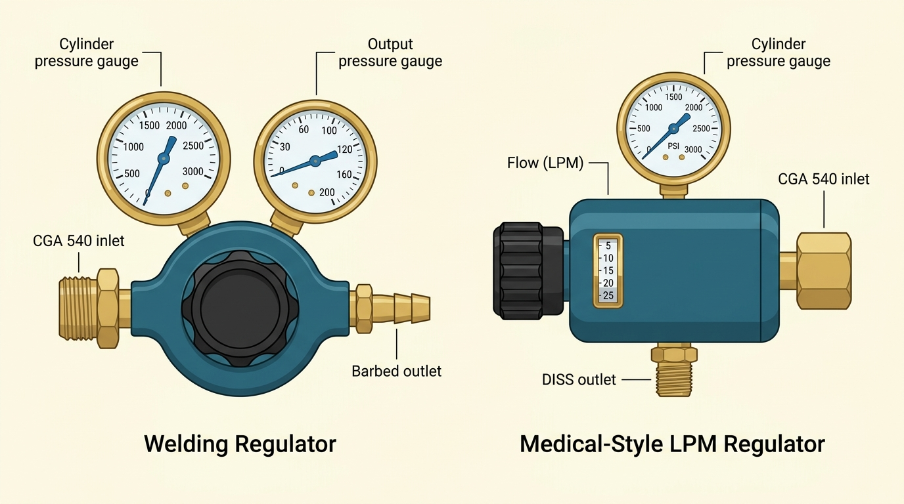

# Equipment

*What each piece of the setup does, how to choose it, and what "good" looks like.*

A working home oxygen setup has four pieces:

1. **Cylinder**: the steel or aluminum tank that holds the oxygen under pressure.
2. **Regulator**: bolts onto the cylinder valve and controls flow rate.
3. **Breathing equipment**: delivers oxygen into your lungs. It can be a demand valve connected to a mouthpiece or to a mask, a ClusterO2 kit, or a more basic non-rebreather mask with a reservoir bag.
4. **Tubing**: a length of standard oxygen tubing connecting the regulator to the breathing equipment.

The sections below walk through each in the order that matters most for aborting an attack — breathing equipment first, since that's the single biggest determinant of whether oxygen works well.

---

## Breathing equipment

Three options are valid for cluster aborts, in rough order of effectiveness:

- **Demand valve** (~$250–400+). Delivers 100% oxygen on demand, matched to your inhalation. No waste between breaths, no waiting for a reservoir bag to fill. Supports the fastest breathing you can produce. In the Petersen 2017 trial, demand valves halved the need for rescue medication compared to a standard mask, and 62% of patients preferred them overall. **Recommended if available.** Can be used with either a sealed mask or a mouthpiece. Typically screws onto a **DISS** outlet on the regulator (see [Regulators](#regulators-fittings-and-tubing)).
  - Example: [Life Support L063-05R](https://www.amazon.com/Life-Support-Products-L063-05R-Demand/dp/B00K36ROVE).
- **ClusterO2 kit** (~$32 from [clusterheadaches.com](https://clusterheadaches.com/shop/index.php?app=ecom&ns=prodshow&ref=clustero2kit); formerly *O2ptimask*). A mask or mouthpiece designed specifically for cluster patients: proper seal, reservoir bag, no side vents that could let room air in. Better than a basic non-rebreather for most people, and significantly cheaper than a demand valve. It comes with a reservoir bag: a small balloon-like bag that hangs below the mask and collects oxygen between breaths. Connects via standard oxygen tubing to a **barb** outlet on the regulator.
- **Standard non-rebreather mask (NRB)** (~$5–10, widely available). Functional but imperfect. The side vents are a safety feature (they prevent suffocation if oxygen runs out while the mask is strapped to the face) but they let room air in and dilute the oxygen. It is recommended to remove the straps and to obstruct the vents. Like the ClusterO2 kit, it comes with a reservoir bag. Connects via standard oxygen tubing to a **barb** outlet.

A basic face mask (no reservoir bag) or a nasal cannula is **not** an acceptable delivery device for cluster aborts, as it cannot deliver pure oxygen at a high enough rate.

*The three delivery options compared. The demand valve and ClusterO2 kit can be used with either a mouthpiece or a sealed mask. The non-rebreather mask typically isn't sealed: it has either side valves or side holes to let out the air you breathe out. It is recommended to close off side holes to prevent outside air from mixing with pure O₂. Insets show the connector type each option requires on the regulator: a DISS fitting for the demand valve, or a barb fitting for the ClusterO2 kit and NRB.*

> **If you have two cylinders** (a large one for home and a smaller portable one), consider a regulator and breathing device for each. For example: a demand valve for home, and a cheaper ClusterO2 kit for the portable cylinder.

---

## Regulators, fittings, and tubing

The regulator is where supplier errors commonly happen: typically, a low-flow (≤8 liters per minute (LPM)) regulator gets substituted for what you actually need (we recommend at least 25 LPM). A regulator has three things to check: **flow range**, **outlet** (the fitting that connects to your breathing equipment), and **inlet** (the fitting that connects to your cylinder). They are explained just below.

### Flow range

- With a prescription, you will typically get a **medical LPM regulator**. A medical regulator has a dial that shows the output flow in liters per minute (LPM). We recommend to get one that can go up to ***at least* 25 liters per minute.** A 40 LPM or ultra-high-flow regulator is worth asking for if available.
- A **welding regulator**, by contrast, shows output pressure and not flow. A welding regulator works perfectly fine for aborts. It is capable of outputting very high flows, so always start on a **low setting**, and adjust upwards. If you're using a reservoir bag, you do that by increasing the flow until the bag fills up sufficiently fast (see [Assembly and testing](#assembly-and-testing)).

> If your DME supplier can't provide a high-flow regulator, you can buy one online for $30–80. This is a one-time cost that routinely makes the difference between oxygen working and oxygen "not working."

*The two regulator types. Left: a standard welding regulator with two pressure gauges and a barbed outlet for standard tubing. Right: a medical-style LPM regulator with a flow dial calibrated in liters per minute and a DISS outlet for demand valves. Both have a CGA 540 inlet that threads onto the cylinder valve.*

### Outlet: barb or DISS

The outlet is the fitting on the downstream side of the regulator — where your tubing or demand valve connects.

- **Barb outlet.** A tapered, barbed fitting that standard oxygen tubing pushes onto. This is what you'll need if you're breathing through a ClusterO2 kit or non-rebreather mask.
- **DISS outlet** (Diameter Index Safety System). A threaded connector used by most demand valves. If you're planning to use a demand valve, confirm the regulator has a DISS outlet, or get a **barb-to-DISS adapter** like [this one](https://www.wtfarley.com/DISS-Male-With-Quarter-Barb).

### Inlet: depends on your cylinder

The inlet is the fitting that threads onto the cylinder valve. It is not interchangeable across cylinder types. A regulator meant for a welding cylinder will not fit a small medical E cylinder without an adapter, and vice-versa.

The inlet fitting varies across regions. The following table is indicative only; double-check with your supplier.

| Region / cylinder type | Inlet fitting |
|---|---|
| US welding cylinders (all sizes) | **CGA 540** (threaded post) |
| US medical, small portable (D, E, M6) | **CGA 870** (pin-index yoke) |
| US medical, larger home sizes (M, H, K) | **CGA 540** (same as welding) |
| UK medical | **Bullnose (BS 341 No. 3)** on older cylinders; pin-index on newer ones |
| Germany, Austria, Switzerland, Poland, Romania, Bulgaria, Slovenia | **DIN 477-9** (threaded, G3/4") |
| France, Spain, Portugal, Belgium (French-influenced) | **AFNOR NF E 29-656** (threaded bullnose) |
| Italy | **UNI 4406** (threaded) |
| Smaller medical cylinders across the EU | **Pin-index (EN ISO 407)** is also common — ask your supplier |

---

## Cylinders

Medical oxygen is delivered as compressed gas in steel or aluminum cylinders. Sizes are labeled by letter (E, M, H/K) in North America and by letter-or-code in the UK and EU. The following table summarizes the characteristics of North American medical cylinders.

| Size | Height | Weight (full) | Capacity | Duration at 25 L/min | Typical role |
|---|---|---|---|---|---|
| **E** | ~75 cm / 30″ | ~8 kg / 18 lb | ~680 L | ~27 min | Portable / car / backup |
| **M** | ~120 cm / 47″ | ~14 kg / 30 lb | ~3,000 L | ~2 hr | Primary home cylinder |
| **H / K** | ~140 cm / 55″ | ~60 kg / 135 lb | ~6,900 L | ~4.5 hr | Heavy-use / fewer refills |

> **Welding cylinders** are sized in cubic feet (cf) — you'd ask for a "size 80" or "size 125" at the counter. The [welding chapter](08-welding-oxygen.md#step-2-choose-a-cylinder-size) has the cf size table.

**Recommendations:**

- **Keep two large cylinders at home if possible.** Running out of oxygen mid-attack is a terrible experience.
- **Have a small portable cylinder for travels.**
- **Track your usage** so you can schedule refills before you're on the last cylinder. A full medical cylinder reads around 2,000–2,200 PSI; call for a refill when it drops below ~500 PSI. Some patients report that oxygen seems to lose effectiveness in the last third of the tank. Never let it drop below 50 PSI before returning the cylinder; some positive pressure is needed to keep moisture and contaminants out.

---

## Assembly and testing

Once you have all four components, setup takes about 10 minutes.

1. **Secure the cylinder upright.** A large, full cylinder is heavy, and a fall can shear off the valve — which can turn the cylinder into a projectile or cause a rapid gas leak. Use a strap, cart, or stand. **When the cylinder is not in use**, disconnect the regulator and cap the valve to prevent accidental hits from damaging it.

2. **Attach the regulator** to the cylinder valve. Hand-tighten first, then snug with an adjustable (crescent) wrench, firm but not forceful; stop when resistance increases and you can't easily turn further. The connection is metal-to-metal: **no tape, no sealant, no grease. Do not use any lubricant**: oil or grease near high-pressure oxygen is a fire and explosion hazard.

3. **Open the cylinder valve slowly**: a quarter turn to start. Listen and feel around the connection for leaks. If you hear hissing, close the valve and reseat the regulator. Once the connection is secure, open the valve all the way for use.

4. **Connect the tubing** from the regulator outlet to the mask or demand valve. Again, use no lubricant.

5. **Set the flow.** If you have a welding regulator, gradually turn the pressure dial open until the reservoir bag fills quickly.

6. **Test it.** Put the mask on and breathe. The reservoir bag should not fully collapse when you inhale; if it does, increase the flow rate.

7. **When done testing, close the cylinder valve** and the regulator dial.

**Reading the pressure gauge:** Your regulator has a gauge showing how much oxygen is left in the cylinder, measured in PSI. A full cylinder reads around 2,000–2,200 PSI. When it drops below 500 PSI, plan your next refill.

*Attaching the regulator to the cylinder valve. Hand-tighten first, then snug with a wrench. Use no lubricant. The illustration shows a CGA 540 connection (welding cylinders and larger US medical cylinders); the procedure is similar for other fittings.*

---

## Safety at home

Oxygen doesn't burn on its own, but it makes everything else burn faster and hotter. The rules below are how millions of home-oxygen users stay safe.

- **No smoking** near the cylinder or while wearing the mask.
- **No open flames or sparks** nearby — candles, stoves, gas heaters, fireplaces.
- **No oil or grease** on the valve, regulator, or fittings. Some lubricants are flammable, and combined with high-pressure oxygen they're a fire and explosion risk.
- **Store the cylinder upright, secured.** A falling cylinder can shear off its valve, causing a dangerous leak or turning it into a projectile.
- **Close the valve after every use.** Don't leave the cylinder open with only the regulator controlling flow. If a fitting fails, you'd release the entire tank into the room, creating an oxygen-enriched atmosphere and a fire hazard.
- **Never return a completely empty cylinder.** Leave at least 50 PSI of positive pressure (your regulator gauge will show this). Without positive pressure, moisture and contaminants can enter the cylinder through the valve.
- **Keep the valve cap on during transport.** It protects the valve from impact damage.
- **Ventilate.** A normal room is fine; just don't use it in a tiny sealed closet.

*Home safety rules for oxygen. These apply equally to medical and welding oxygen.*

---

*Next: [Aborting an attack with oxygen](02-aborting-with-oxygen.md) · [Getting a prescription](03-getting-a-prescription.md) · [Welding oxygen alternative](08-welding-oxygen.md) · [FAQ](04-faq.md)*
