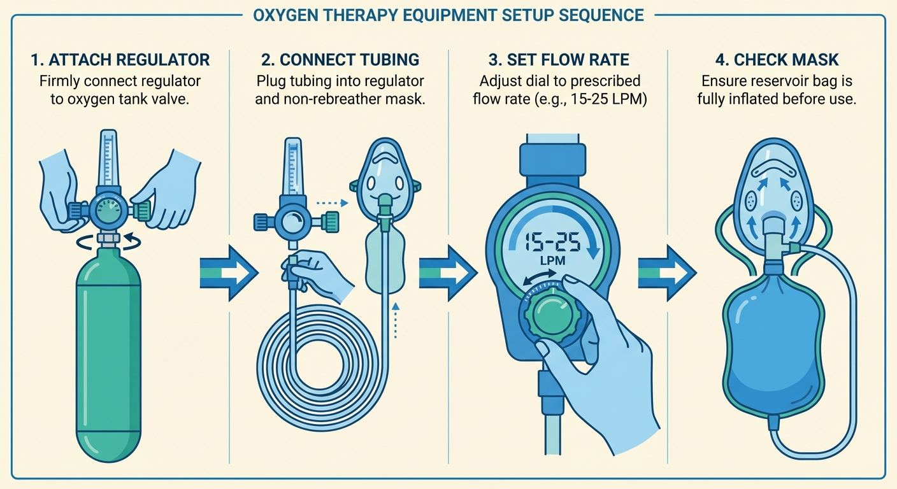

# Getting Your Oxygen

You have a prescription and you know what equipment you need. Now you need to get oxygen delivered to your home.

---

## How oxygen delivery works

The general process in most countries:

1. Your doctor writes the prescription.
2. The prescription goes to an **oxygen supplier** — a company that stores, fills, and delivers medical oxygen cylinders.
3. The supplier contacts you, schedules delivery, and brings the equipment to your home.
4. When your tanks run low, you call the supplier for refills.

In the US, the supplier is typically a **durable medical equipment (DME) company** — a company that delivers medical equipment like oxygen tanks to your home. Your doctor's office may have a preferred supplier, or your insurance may dictate which one to use. In the UK, it's handled by **BOC** or **Baywater** through the NHS. In other countries, the arrangement varies — ask your doctor's office who handles medical oxygen in your area.

Most suppliers can deliver within 1–3 business days. If you're in an active cycle, tell your doctor's office it's urgent.

## Choosing a supplier

If you have a choice of suppliers, look for:

- **Experience with cluster headache patients.** Most of the supplier's business is COPD (chronic obstructive pulmonary disease) patients who use 2–4 L/min. A supplier who understands cluster headache will know you need high-flow regulators, larger tanks, and more frequent refills.
- **High-flow regulators in stock.** Ask upfront: "Do you carry regulators that go to 15 or 25 liters per minute?" If the answer is no, that's a red flag.
- **Reliable refill schedule.** During a cluster cycle, you may go through oxygen quickly. You need a supplier who can refill on a predictable schedule — and respond to urgent requests.
- **Emergency or weekend delivery.** Cluster headaches don't wait for business hours. Ask whether they offer after-hours delivery or whether you should keep extra tanks on hand (the answer is usually: keep extra tanks on hand regardless).

## Common supplier problems

These problems come up again and again in patient communities. Knowing about them in advance helps you push back effectively.

### "We only have regulators up to 8 L/min"

This is the most common problem. The supplier stocks low-flow regulators for their COPD patients and doesn't carry high-flow ones.

**What to do:** Insist on a 15–25 L/min regulator. If the supplier can't provide one, purchase your own — they're available from medical supply retailers for $30–80 and are a one-time purchase. Make sure it has the right fitting for your tanks (CGA 540 in the US).

### "We'll send a concentrator instead of tanks"

Some suppliers prefer concentrators because they're cheaper to maintain (no refills). But as discussed in the [equipment section](04-equipment.md), most concentrators can't deliver the flow rates you need.

**What to do:** Politely but firmly decline. Explain that your prescription specifies high-flow compressed gas, and that a 5–10 L/min concentrator is not adequate for cluster headache treatment. If the supplier pushes back, have your doctor call them.

### Slow refills during a cluster cycle

During an active cycle, you might use oxygen multiple times a day. Tanks run out faster than you expect, and the supplier's normal delivery schedule may not keep up.

**What to do:**

- Always have at least one full backup tank.
- Track your usage so you can call for refills *before* you're on your last tank, not after.
- Ask your supplier about their maximum delivery frequency. If it's not enough, ask about getting larger tanks (H/K size — about 140 cm / 55 in tall, ~60 kg / 135 lbs) or additional tanks.
- Your supplier will exchange empty tanks for full ones on a regular schedule. Call to arrange returns.
- As a last resort, some patients keep a welding oxygen tank as an emergency backup — welding oxygen is chemically identical to medical oxygen, though produced under less strict quality controls. See the [prescription page](03-getting-a-prescription.md#welding-oxygen) for details.

## Setting up at home

### Where to store tanks

- **Upright and secured.** Oxygen tanks are heavy and pressurised. If one falls and the valve breaks, it becomes a projectile. Secure tanks in a stand, rack, or against a wall with a strap or chain.
- **Away from heat and open flame.** Oxygen doesn't burn, but it makes everything around it burn faster and hotter. Keep tanks at least 5–10 feet (2–3 meters) away from stoves, heaters, candles, and anything that produces sparks. Do not smoke near oxygen tanks.
- **In a ventilated area.** Don't store tanks in a sealed closet or car trunk. A slow leak in an enclosed space raises the oxygen concentration, which increases fire risk.
- **Accessible.** You need to reach your oxygen quickly when an attack starts. Don't store it in the attic or the back of a garage. Keep your primary tank where you spend the most time — typically the bedroom (for nocturnal attacks) or the living room.

### Assembling the equipment

*Step by step: attach the regulator to the tank, connect the mask tubing, open the valve, set the flow rate.*

1. **Attach the regulator to the tank.** Remove the dust cap from the tank valve (the metal fitting at the top of the tank). Place the regulator on the valve and tighten the connection nut by hand, then snug it with an adjustable wrench (a common adjustable wrench). Many regulators come with the right wrench, or your supplier may provide one. Don't overtighten — just snug enough that it doesn't leak.
2. **Connect the mask.** Attach the oxygen tubing from your mask to the barb fitting on the regulator (the small nozzle that the tubing pushes onto).
3. **Test for leaks.** Slowly open the tank valve (the large knob on top of the tank — turn it counter-clockwise). Listen for hissing from the regulator connection. If you hear one, tighten the connection or check the washer — a small rubber or plastic ring that sits between the regulator and the tank valve. If it's cracked, flattened, or missing, replace it. Your supplier or a hardware store will have spares, and regulators often come with extras.
4. **Set the flow rate.** On the regulator (not the tank valve), turn the flow control dial to the highest setting available. This is usually a smaller knob or dial with numbers marked in liters per minute.
5. **Check the mask.** If using a non-rebreather, confirm the reservoir bag inflates. Put the mask on and breathe — you should feel steady airflow.
6. **Leave it assembled.** Once set up, leave the equipment ready to go. When an attack starts, all you need to do is open the tank valve and put on the mask.

## Travel with oxygen

### Driving

You can travel with oxygen in your car. Secure the tank so it won't roll or fall (a seatbelt around a small tank works). Open a window an inch or two for air circulation, even in cold weather — a slow oxygen leak in a sealed car raises fire risk. Keep a portable E-size tank (about 75 cm / 30 in tall, ~8 kg / 18 lbs — small enough to carry) in the car during a cluster cycle.

### Flying

You generally **cannot bring your own oxygen tank on an airplane**. Airlines prohibit personal compressed gas cylinders. Options:

- **Airline-provided oxygen.** Some airlines offer supplemental oxygen for a fee, but this is typically low-flow and not suitable for cluster headaches.
- **Arrange oxygen at your destination.** Search online for "medical oxygen rental" or "portable oxygen delivery" plus the city name. Your doctor can fax or email the prescription, and your home supplier may be able to recommend a company that operates nationally.
- **Portable oxygen concentrators (POCs)** are allowed on most airlines with advance approval. They don't produce enough flow for a full abort, but some patients find partial relief better than none.

Plan ahead. Running out of oxygen or not having access during a cluster cycle away from home is a situation you want to avoid.

### At work

If you have attacks during the workday, keep an E-size tank at your workplace. Talk to your employer if necessary — this is a medical accommodation.

## Regional notes

The supplier landscape differs by country. For details on insurance coverage and prescriptions in specific countries, see the [Getting a prescription](03-getting-a-prescription.md) page.

---

*← [What you need](04-equipment.md) | [Using oxygen effectively →](06-using-oxygen.md)*
