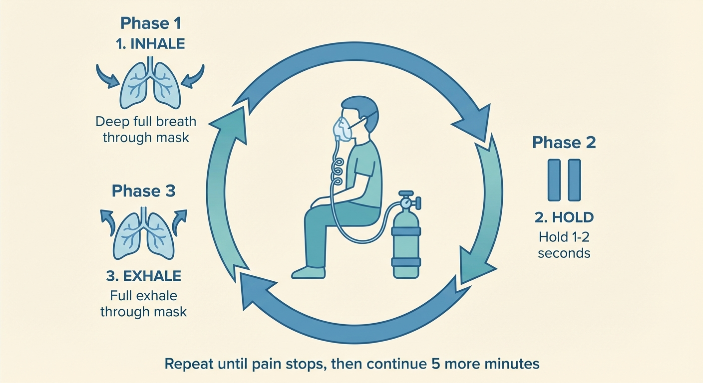

# Using Oxygen Effectively

This is the most important page in the guide. Getting the technique right is the difference between oxygen being a lifesaver and oxygen feeling like it doesn't work.

---

## Before your first time

Test your setup *before* you have an attack. During an attack, you'll be in severe pain — that is not the time to figure out how your equipment works.

- [ ] Your tank is full and the valve opens smoothly
- [ ] Your regulator is attached and set to the highest flow rate available
- [ ] Your mask fits snugly over your nose and mouth with no gaps
- [ ] If using a non-rebreather mask: the reservoir bag inflates fully when the tank is on
- [ ] You have a backup tank ready
- [ ] You know exactly where your equipment is and can reach it in seconds
- [ ] If you live with someone, they know where the equipment is too

Once you've confirmed everything works, turn the tank off and leave the setup assembled. You want to go from "attack starting" to "breathing oxygen" as quickly as possible.

## The abort procedure

### Step by step

1. **As soon as you feel an attack starting, get to your oxygen.** The earlier you start, the better it works. Don't wait to see if the attack will get worse — act immediately.

2. **Sit upright.** Some patients find leaning forward slightly helps. Experiment to find what works best for you.

3. **Turn on the tank and set the flow to the highest available setting.** If your regulator goes to 15 L/min, use 15. If it goes to 25, use 25. More is better — you cannot overdose on oxygen in a session this short.

4. **If using a non-rebreather mask:** wait a few seconds for the reservoir bag to fill before putting the mask on.

5. **Put the mask on and ensure a tight seal.** Press it firmly against your face. Any gaps mean you're breathing room air instead of pure oxygen, which reduces effectiveness significantly. If using a non-rebreather mask with side holes, many patients tape them shut to prevent air leaking in.

6. **Breathe deeply and steadily.** Inhale fully through the mask, hold for a moment, then exhale fully. The goal is to get as much oxygen into your lungs as possible with each breath.

7. **Continue breathing until the pain stops.** For most patients, this takes 5–15 minutes. Some respond in as little as 3–6 minutes. Don't give up if it hasn't worked at 10 minutes — keep going.

8. **After the pain stops, keep breathing for at least 5 more minutes.** This helps prevent the attack from bouncing back. Many patients learn this the hard way: stopping too soon means the pain returns within minutes.

### How long to stay on oxygen

Sessions under an hour are very safe — there is little risk of oxygen toxicity at these durations. Beyond the initial abort, patients' experience varies:

- **Some patients** find that if oxygen hasn't aborted the attack within about 20 minutes, it's not going to. They stop and try something else.
- **Other patients** find that staying on oxygen past the 20-minute mark — even when it doesn't fully abort the attack — still makes the pain noticeably more manageable.

There's no single right answer here. Experiment and find what works for you. The safety margin is wide.

## Breathing techniques

There are two main approaches, and both have advocates:

### Aggressive hyperventilation
Breathe as rapidly and deeply as you can for the first 2–3 minutes. Fast, forceful inhales — don't worry about looking or sounding ridiculous. The idea is to flood your system with oxygen as quickly as possible. Many experienced patients swear by this approach, especially at the start of an attack.

After the initial burst, you can settle into a slower, steadier rhythm.

### Steady deep breathing
Breathe deeply but at a normal pace. Full inhale, brief hold (1–2 seconds), full exhale. Consistent and controlled throughout the session.

### Which is better?
Neither approach has been proven superior in clinical trials. Many patients start with aggressive hyperventilation to "hit it hard" and then transition to steady breathing once the pain starts to ease. Try both and see what your body responds to best.

## Timing expectations

Knowing what to expect helps you stay calm and keep going:

- **3–6 minutes:** Some patients feel significant relief this quickly, especially with a demand valve and aggressive breathing.
- **5–15 minutes:** The typical range for most patients who respond to oxygen.
- **15–20 minutes:** Still possible. Don't give up at 10 minutes thinking it's not working.
- **Beyond 20 minutes:** The attack may not fully abort, but staying on oxygen can still reduce pain intensity. See "How long to stay on oxygen" above.

If you consistently get no relief after 20+ minutes across multiple attacks, revisit your setup before concluding that oxygen doesn't work for you. The most common reasons oxygen "fails" are equipment problems, not treatment problems:

- Flow rate too low (you need the highest your regulator allows — at least 15 L/min)
- Mask leaking (gaps around the nose or through side holes on a non-rebreather)
- Starting too late (oxygen works best when started at the very first sign of an attack)
- Wrong mask type (a simple oxygen mask is not the same as a non-rebreather or demand valve)

## If oxygen alone isn't enough

For some attacks — especially severe or late-caught ones — oxygen on its own may not be enough. A few options patients report:

- **Caffeine:** Some patients drink a strong coffee or energy drink at the start of an attack alongside oxygen. This is anecdotal but widespread in patient communities.
- **DMT:** Inhaled DMT can abort attacks faster than oxygen — often in under a minute. Some patients keep both available and reach for DMT when speed is critical. See our [DMT guide](index.html) for details.

## Optimising your setup

Once you have the basics working, there are several parameters worth experimenting with. Small changes can make a meaningful difference:

- **Flow rate:** If your regulator maxes out at 15 L/min and oxygen is working but slowly, consider getting a 0–25 L/min regulator. Higher flow rates mean more oxygen per breath.
- **Mask type:** If you're using a non-rebreather mask and oxygen is slow to work, consider upgrading to a demand valve. Demand valves deliver 100% oxygen with no air leakage, and many experienced patients consider them a significant upgrade. See the [equipment page](04-equipment.md) for details.
- **Mask fit:** Even small leaks reduce effectiveness. Press the mask firmly, and if using a non-rebreather, tape the side holes shut.
- **Body position:** Most patients sit upright. Some find leaning forward helps. A few find standing works better. Experiment.
- **Breathing pattern:** Try the hyperventilation technique described above if you haven't already.
- **Starting early:** This is the single biggest factor. Oxygen is dramatically more effective when started at the very first sign of an attack — even a shadow of one — than when started after the pain has peaked.

*Breathe deeply through the mask: full inhale, brief hold, full exhale. Repeat until the pain stops, then continue for 5 more minutes.*

## Quick reference card

Print this and keep it near your oxygen setup.

---

**Aborting a cluster headache with oxygen**

1. Feel attack starting → go to oxygen immediately
2. Sit upright, turn on tank to highest flow
3. Let reservoir bag fill (if using non-rebreather mask)
4. Put mask on — tight seal, no gaps
5. Breathe deeply: full inhale, brief hold, full exhale
6. Continue until pain stops (typically 5–15 minutes)
7. Keep breathing 5 more minutes after pain stops
8. Turn off tank

**If it's not working:** Check flow rate (highest possible), check mask seal (no leaks), try hyperventilation technique.

---

*← [Getting your oxygen](05-working-with-suppliers.md) | [FAQ →](07-faq.md)*
