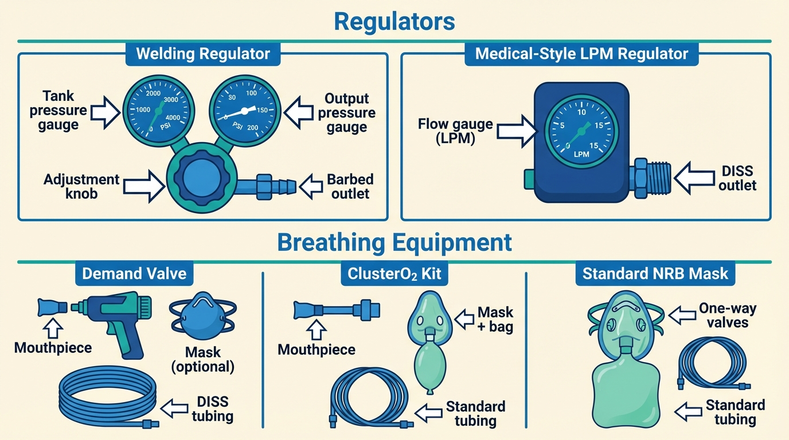
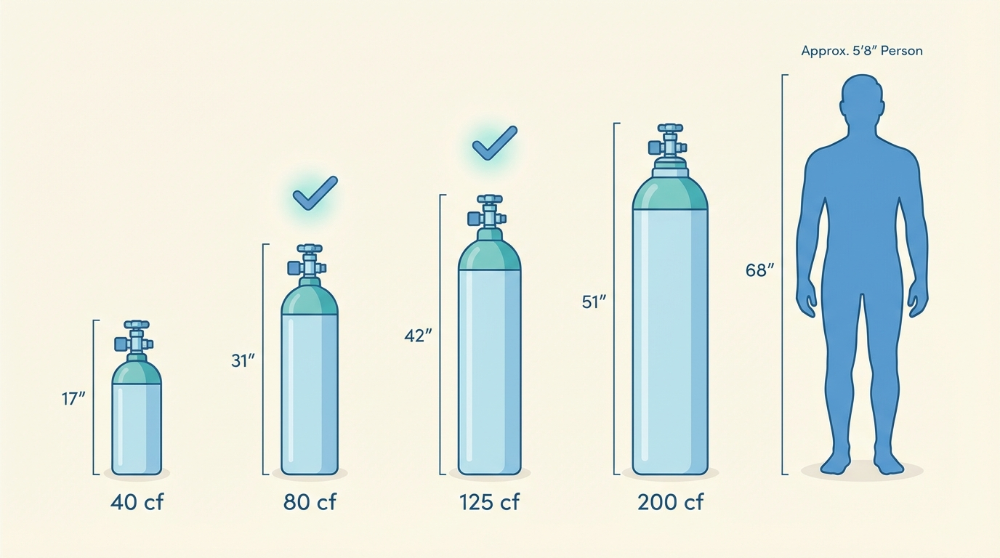
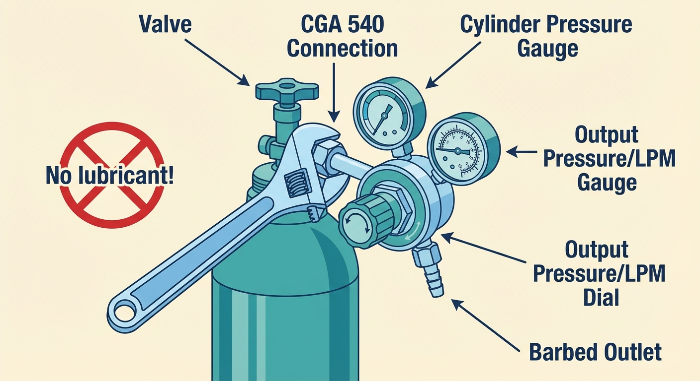
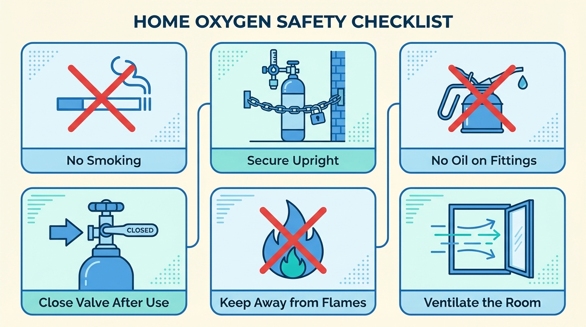

# Welding Oxygen: A Practical Alternative

*When you can't get medical oxygen — what welding oxygen is, why it's safe, and how to set it up.*

If you're reading this page, you probably already know that high-flow oxygen can stop cluster headache attacks. But getting a prescription, finding a willing doctor, and navigating insurance can feel like an obstacle course — and for many patients, it's one they can't get past. A 2011 survey found that 41% of patients prescribed home oxygen were denied coverage by their insurers.[1] The cost of medical oxygen through a Durable Medical Equipment (DME) supplier — the companies that deliver medical oxygen to your home — can run $200–400 or more per month without insurance.

Welding oxygen is the most common workaround. It's sold at welding supply shops across the country, requires no prescription, and costs a fraction of the medical route. The same survey found that 12% of US cluster headache patients were already using it.[1] On patient forums like ClusterBusters, members have discussed and used welding oxygen for over a decade.

If the words "welding oxygen" make you nervous, that's understandable. By the end of this page, you'll know exactly what welding oxygen is, why it's safe, what equipment to buy, and how to set it up — step by step.

## Is Welding Oxygen Safe to Breathe?

Yes. Here's why.

### The gas is the same

Both medical and welding oxygen are produced by the same industrial process — cryogenic fractional distillation of air. In many facilities, the gas comes from the **same bulk tank**. The difference between what's labeled "medical" and what's labeled "welding" is paperwork, not chemistry.

Medical oxygen (USP grade) must be at least 99.0% pure. Welding oxygen, in practice, routinely tests at 99.5% or higher — modern air-separation plants simply don't have a separate "dirty" production line. As Francois Burman, a professional engineer at Divers Alert Network, concluded after investigating this question for scuba diving: **"Oxygen is oxygen, and if the purity exceeds 99 percent, it is safe for use where pure oxygen is required."**[2]

The aviation and scuba diving communities reached the same conclusion years ago. The old distinction between "breathing grade" and "welding grade" traces back to decades-old compression methods that are no longer in use.

### No documented harm

No adverse events from breathing welding oxygen appear in the medical literature, FDA databases, or patient community reporting. The 2011 survey found 12% of respondents using it;[1] a 2022 review of the full evidence base on oxygen therapy for headache disorders cited no case reports of harm from the practice.[3] ClusterBusters forum threads document patients using welding oxygen for years without adverse effects.[4][5] Absence of evidence isn't proof of safety, but the scale — a large survey, over a decade of forum history — makes serious unnoticed harm unlikely.

### The real difference: the cylinder, not the gas

Medical cylinders are cleaned, evacuated, and inspected before every refill under FDA rules. Welding cylinders are not subject to these rules — in theory, a welding cylinder could retain traces of previous contents or develop internal moisture over time. In practice, oxygen cylinders from reputable suppliers are dedicated to oxygen and handled carefully, because contamination is a safety risk for welding too. The documented cylinder-related incidents in the FDA's records — gas mix-ups and solvent contamination — actually occurred with *medical* cylinders in medical settings, not with welding oxygen used by patients at home.[6][7]

Using a reputable supplier and an oxygen-dedicated cylinder addresses this concern.

### Fire safety: the real risk (same for all oxygen)

The most important safety consideration has nothing to do with whether your oxygen is labeled "medical" or "welding." **Oxygen makes things burn faster and hotter.** It doesn't burn on its own, but a spark that would fizzle in normal air can become a fully developed fire in an oxygen-enriched atmosphere. This is true of all oxygen, regardless of grade or label. The good news: millions of patients use oxygen at home safely by following simple rules — see the [Safety at Home](#safety-at-home) section below for the full list.

> **The bottom line:** Welding oxygen is the same gas as medical oxygen. The safety considerations — mainly fire risk — are the same too, and manageable with common-sense precautions.

## What You'll Need

The setup has four components:

1. **A cylinder** — the steel tank that holds the oxygen under pressure.
2. **A regulator** — attaches to the cylinder valve and controls how fast the oxygen flows.
3. **A mask** — covers your nose and mouth to deliver the oxygen.
4. **Tubing** — a length of standard oxygen tubing connecting the regulator to the mask.

*The four components of a welding oxygen setup and how they connect.*

That's it. The total cost to set up from scratch is roughly **$135–225**, depending on your choices. Ongoing costs are about **$35–65 per month** (cylinder rental plus refills). Compare that to $200–400+ per month through a DME supplier without insurance.

The following sections walk you through choosing and buying each component.

## Step by Step: Getting Your Setup

### Step 1: Find a supplier

The most commonly mentioned supplier on patient forums is **Airgas**, which has locations across the US. Other options include **Linde** (another major national chain), local welding supply shops, farm supply stores, and industrial gas distributors.

**What to expect at the store:**

You're buying a commodity — oxygen for welding. No prescription needed, no medical questions asked. You do not need to explain why you want it, and the staff won't ask.

**Do not tell the supplier you intend to breathe it.** This is emphatic, recurring advice across patient forums. If you disclose breathing intent, the supplier may refuse to sell to you — they aren't licensed to sell breathing gas without a prescription, and they don't want the liability. If asked what it's for, you're buying it for welding.

You'll need to either **rent** a cylinder or **buy one outright**. Some locations require opening a basic customer account (name, address, credit card); others serve walk-ins. At some Airgas locations, cylinders over 40 cubic feet require a commercial account with a tax ID — policies vary by branch, so call ahead.

**Rent vs. buy:**

- **Renting** is simpler for most people: ~$15–25/month. You swap an empty cylinder for a full one; the supplier maintains the cylinder.
- **Buying** avoids ongoing rental fees ($100–200+ for the cylinder), but you own it and are responsible for periodic hydrostatic testing (required every 5–10 years). Purchased cylinders are filled on-site rather than exchanged.

> If one location gives you trouble, try another. Farm supply stores and small independent welding shops are often more flexible than corporate branches.

### Step 2: Choose a cylinder size

Welding cylinders are sold by their capacity in **cubic feet (cf)** — you'd ask for a "size 80" or a "size 125" at the counter.

**Get the largest cylinder you can realistically carry to your home.** A bigger cylinder means fewer refill trips and less chance of running out mid-cycle — which, by wide community consensus, is one of the worst things that can happen. The decision comes down to what you can physically handle: can you carry it up stairs? Does it fit in your car? An 80 cf cylinder weighs about 56 lbs (25 kg) and is manageable for most people. A 125 cf weighs about 75 lbs (34 kg). A 200 cf weighs about 128 lbs (58 kg) and needs a hand truck or cylinder cart.

Here are the most common sizes:

| Size | Capacity | Height × diameter | Weight (full) | Approx. aborts* |
|---|---|---|---|---|
| 40 cf | ~1,133 liters | 17″ × 7″ | ~27 lbs (12 kg) | ~7 |
| 80 cf | ~2,265 liters | 31″ × 7″ | ~56 lbs (25 kg) | ~15 |
| 125 cf | ~3,540 liters | 42″ × 7″ | ~75 lbs (34 kg) | ~24 |
| 200 cf | ~7,079 liters | 51″ × 9″ | ~128 lbs (58 kg) | ~47 |

*Approximate number of 10-minute aborting attempts at 15 LPM (150 liters each).

All standard welding oxygen cylinders use the **CGA 540** valve connection — a large threaded post. As long as your regulator says "CGA 540" on the packaging, it will fit any standard welding oxygen cylinder. Note: if you've seen the small portable oxygen tanks used in hospitals, those use a different, incompatible connection — so don't buy a regulator designed for those.

*Cylinder size comparison. The 80 and 125 cf sizes are the most popular for home use. The 200 cf holds far more gas but requires a cart.*

**Keep at least two cylinders.** Running out of oxygen during a cluster cycle is something patients consistently describe as one of the worst things that can happen. Most patients keep one large cylinder at home and, if budget allows, a smaller portable one.

### Step 3: Get a regulator

This is the part where most newcomers trip up — but it's actually simple once you know what to buy.

A **welding regulator** shows output pressure in PSI, not liters per minute. It's designed for cutting torches, not breathing. You *can* use one — adjust the valve until the reservoir bag on your mask fills quickly during fast breathing — but you're guessing at flow rate and it takes some trial and error.

**For beginners, a medical-style LPM regulator is strongly recommended.** It gives you a clear dial showing exactly how many liters per minute you're delivering, which takes the guesswork out of the equation.

Buy a medical-style oxygen regulator with a **CGA 540** fitting and a **0–25 LPM flowmeter**. These are widely available online for $40–70 — far cheaper than the regulators sold at welding supply stores. Key specs to look for:

- **CGA 540 inlet** (matches welding cylinders)
- **0–25 LPM flow range** — many cheap regulators max out at 15 LPM, which is the bare minimum for cluster headache therapy. 25 LPM is strongly preferred.
- **Barb outlet** — a barbed outlet lets you push standard oxygen tubing directly onto the regulator. Some regulators have a threaded "DISS" connector instead, which requires a small adapter. Either works, but a barb outlet is simpler.

The single most recommended regulator across ClusterBusters forums is the **Harbor Freight oxygen regulator (model #94846)** — cheap and widely endorsed by long-term users. Another good option is the **Responsive Respiratory 25 LPM CGA 540 regulator** (~$50–70 online). Avoid anything labeled "0–8 LPM" or "pediatric" — the flow rate is too low for cluster headache therapy.

### Step 4: Get a mask

Your mask is how the oxygen reaches you. The right mask makes a surprising difference — a poor seal means you're breathing room air mixed with oxygen instead of pure O₂, which reduces effectiveness.

Three options:

- **O2ptimask** (~$25 from clusterheadaches.com) — Designed specifically for cluster headache patients. No side vents, tight seal, available in two sizes, with a mouth-tube option. This is the most commonly recommended mask on patient forums.
- **Standard non-rebreather mask (NRB)** (~$5–10, widely available) — Functional, but has side vents by design. These vents are a safety feature (they prevent suffocation if oxygen runs out), but they also let room air in and dilute the oxygen concentration. Some patients tape over the vents to improve the seal. NRB masks come with a **reservoir bag** — a small balloon-like bag that hangs below the mask and collects oxygen between breaths so you have a full breath available when you inhale.
- **Demand valve** (~$250–400+) — Delivers 100% O₂ on demand, as much as you can inhale, and shuts off automatically between breaths. No wasted gas, no waiting for a reservoir bag to refill. Expensive upfront, but uses oxygen far more efficiently, so cylinders last much longer.

You'll also need **standard oxygen tubing** (typically 7-foot length, ~$5, widely available) to connect the regulator's outlet to the mask.

### Step 5: Assemble and test

Once you have all four components, setup takes about 10 minutes:

1. **Secure the cylinder upright.** Chain or strap it to a wall, heavy furniture, or a cylinder cart ($30–60). A full cylinder is heavy, and a fall can shear off the valve — which can turn the cylinder into a dangerous projectile or cause a rapid gas leak.

2. **Attach the regulator** to the CGA 540 valve. Hand-tighten first, then snug with an adjustable (crescent) wrench — firm but not forceful; stop when resistance increases and you can't easily turn further. The connection is metal-to-metal: no tape, no sealant, no grease. **Do not use any lubricant** — oil or grease near high-pressure oxygen is a fire and explosion hazard.

3. **Open the cylinder valve slowly** — a quarter turn to start. Listen and feel around the connection for leaks. If you hear hissing, close the valve and reseat the regulator. Once the connection is secure, open the valve all the way for use.

4. **Connect the tubing** from the regulator outlet to the mask.

5. **Set the flow rate** on your LPM regulator (start at 15 LPM; adjust up to 25 LPM as needed). If you're using a welding regulator, adjust the valve until the reservoir bag fills quickly.

6. **Test it.** Put the mask on and breathe. The reservoir bag should not fully collapse when you inhale — if it does, increase the flow rate.

**Reading the pressure gauge:** Your regulator has a gauge showing how much oxygen is left in the cylinder, measured in PSI. A full cylinder reads around 2,000–2,200 PSI. When it drops below 500 PSI, plan your next refill. Never let it drop below 50 PSI before returning the cylinder — some positive pressure is needed to keep moisture and contaminants out.

*Attaching the regulator to the cylinder valve. Hand-tighten first, then snug with a wrench. No lubricant — ever.*

## Breathing Technique

Technique matters as much as equipment. Several patients who initially reported that "oxygen doesn't work" later found it highly effective once they changed how they breathed.

- **Get on the oxygen at the very first sign of an attack.** The earlier you start, the faster the abort. Waiting reduces effectiveness.
- **Breathe deeply and rapidly** at high flow (25 LPM). Take big, full breaths as fast as you comfortably can — filling your lungs completely each time, then exhaling forcefully and immediately inhaling again.
- **The bag should never fully collapse** on inhalation. If it does, increase the flow rate.
- **Stay on the oxygen for 5–10 minutes after the pain stops.** This is strong community consensus. Stopping immediately risks a rebound — the headache returns within minutes. The extra time on O₂ extends your pain-free window.

For more detail on breathing techniques and the aborting protocol, see the [main oxygen guide](06-using-oxygen.md).

## Safety at Home

These rules apply to all oxygen, medical or welding. Post them somewhere visible near your cylinder.

- **No smoking** near the cylinder or while wearing the mask.
- **No open flames or sparks** nearby. Keep the cylinder away from stoves, heaters, candles, and anything that could spark.
- **No oil or grease** on the valve, regulator, or fittings — some lubricants are flammable, and combined with high-pressure oxygen, they're a fire and explosion risk.
- **Store the cylinder upright, secured** with a chain, strap, or cart. A falling cylinder can shear off its valve, causing a dangerous leak or turning it into a projectile.
- **Close the valve after every use.** Don't leave the cylinder open with only the regulator controlling flow. If a fitting fails, you'd release the entire tank into the room — creating an oxygen-enriched atmosphere and a fire hazard.
- **Never return a completely empty cylinder.** Leave at least 50 PSI of positive pressure (your regulator gauge will show this). Without positive pressure, moisture and contaminants can enter the cylinder through the valve.
- **Keep the valve cap on during transport.** It protects the valve from impact damage.
- **Ventilate.** A normal room is fine — just don't use it in a tiny sealed closet.

*Home safety rules for oxygen. These apply equally to medical and welding oxygen.*

## Getting Refills

- **Exchange model (rented cylinders):** Bring the empty to the supplier, swap for a full one. Takes minutes.
- **Refill model (owned cylinders):** Drop off your cylinder, they fill it (sometimes while you wait, sometimes next business day). Cost: ~$20–40 per fill, depending on size.

Cluster Headache Warriors recommends asking suppliers to vacuum-purge the cylinder before filling, which clears any residual moisture or traces from previous contents.[8] Many suppliers do this routinely; asking doesn't hurt.

## Cost Summary

| Item | Approximate cost | Notes |
|---|---|---|
| Cylinder rental (monthly) | $15–25/month | Or buy outright for $100–200+ |
| Cylinder fill | $20–40 per fill | Depends on size |
| CGA 540 regulator (0–25 LPM) | $40–70 | One-time purchase |
| O2ptimask | ~$25 | Or standard NRB for ~$5 |
| Demand valve (optional upgrade) | $250–400+ | Most efficient O₂ use |
| Oxygen tubing | ~$5 | Standard 7-foot |
| Cylinder cart or strap | $30–60 | One-time; optional but recommended |
| **Total first month** | **~$135–225** | |
| **Ongoing monthly** | **~$35–65** | Rental + 1–2 refills |

Compare: medical oxygen through a DME supplier without insurance often costs **$200–400+ per month**.

## Tips from the Community

Practical wisdom from patients who've been through this:

1. **You burn through gas faster than you expect.** At 25 LPM, an 80 cf tank gives you about 90 minutes of total use. During heavy cluster periods, you may need multiple refills per week. This is why bigger cylinders are worth the effort.

2. **Set everything up before a cycle starts.** When an attack hits at 3 AM, you'll be in severe pain, possibly disoriented, fumbling in the dark. The last thing you want is to be assembling equipment for the first time. Set it up, test it, and keep the mask within arm's reach of your bed.

3. **The mask matters more than you think.** A mask with a poor seal wastes oxygen and reduces effectiveness. Upgrading from a basic NRB to an O2ptimask or taping over the NRB's side vents is a meaningful improvement.

---

## References

1. Rozen TD. "Inhaled oxygen and cluster headache sufferers in the United States: use, efficacy and economics: results from the United States Cluster Headache Survey." *Headache.* 2011;51(4). [PubMed](https://pubmed.ncbi.nlm.nih.gov/21083557/)
2. Burman F. "Do I Need Medical Grade Oxygen?" *Alert Diver*, Q4 2022. [Divers Alert Network](https://dan.org/alert-diver/article/do-i-need-medical-grade-oxygen/)
3. Mo H et al. "Oxygen therapy for headache disorders: a comprehensive review." *Pain Physician.* 2022. [PMC](https://pmc.ncbi.nlm.nih.gov/articles/PMC9163947/)
4. ClusterBusters forum: "Welding Oxygen" (2016–2023). [Thread](https://clusterbusters.org/forums/topic/4464-welding-oxygen/)
5. ClusterBusters forum: "Welding Oxygen Usage Feedback." [Thread](https://clusterbusters.org/forums/topic/5167-welding-oxygen-usage-feedback/)
6. FDA. "Current Good Manufacturing Practice, Certification, Postmarketing Safety Reporting, and Labeling for Medical Gases." Final Rule, 2024. [Federal Register](https://www.federalregister.gov/documents/2024/06/18/2024-13190/current-good-manufacturing-practice-certification-postmarketing-safety-reporting-and-labeling)
7. FDA. "Medical Gas Containers and Closures; Current Good Manufacturing Practice Requirements." 2016. [Federal Register](https://www.federalregister.gov/documents/2016/11/18/2016-27838/medical-gas-containers-and-closures-current-good-manufacturing-practice-requirements)
8. Cluster Headache Warriors. "Welder's O2 — A Last Resort." [Guide](https://clusterheadachewarriors.org/guide-category/oxygen-guides/welders-o2-last-resort/)
